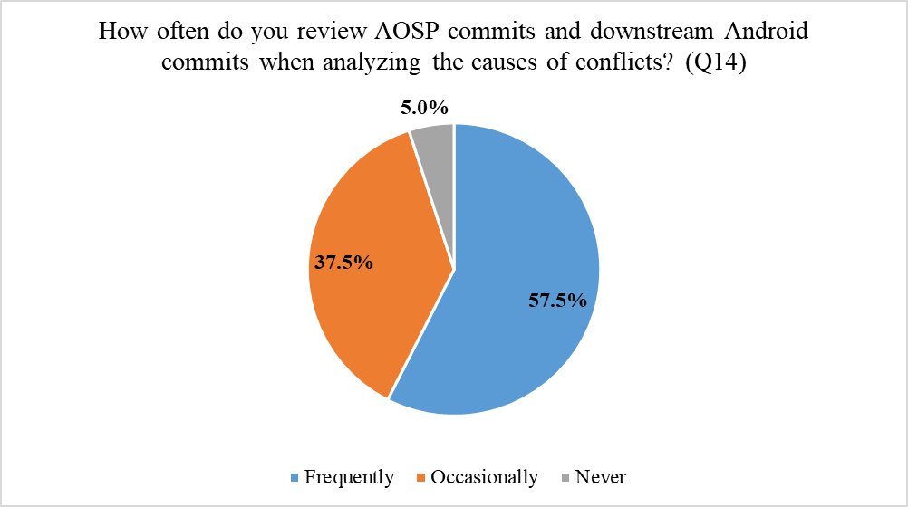
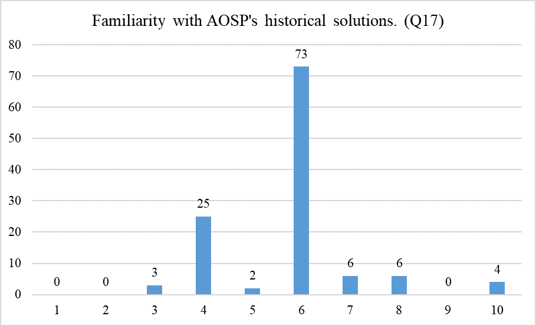
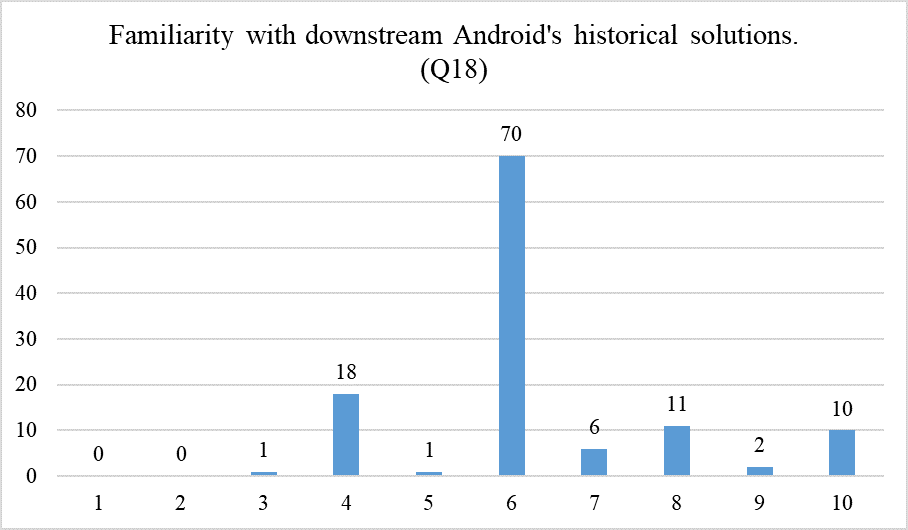
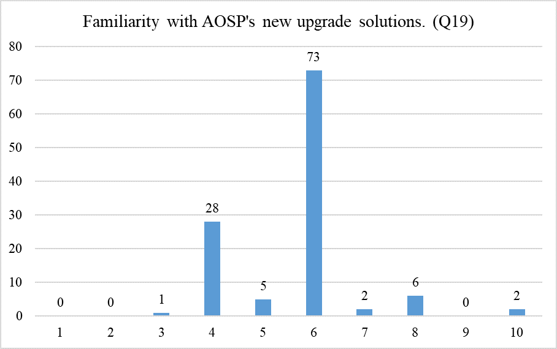
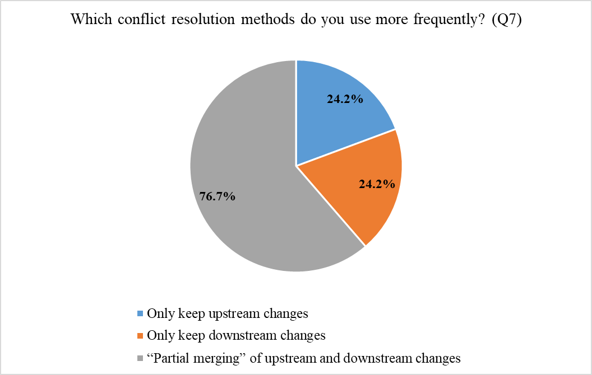
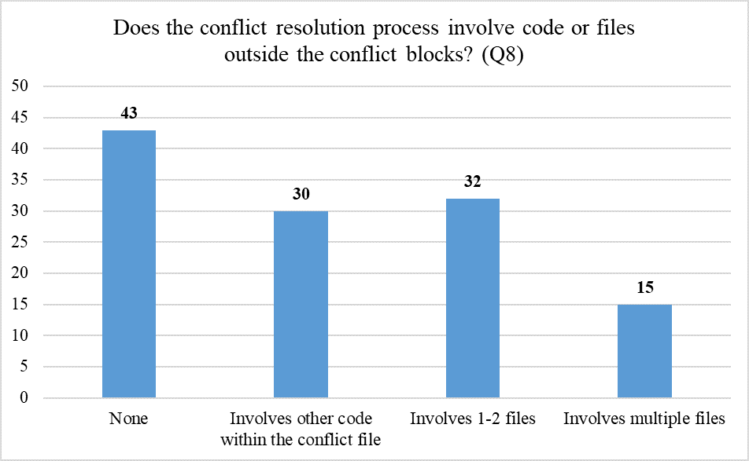

# Supplement F Statistical Data

1. In **O3.1**, we calculated the average of the time proportion and found that ① identifying conflict location takes **5.8%** of the time; ② tracing back historical changes consumes **47.3%;**  ③ conceiving conflict resolution solutions consumes **32.4%**; and ④ implementing solution takes **14.5%**.  The statistical data is as follows. The data in the table reflects the proportion of time allocated by each participant to each step.

   ***Table 1: The distribution of time required in different stages during conflict resolution***
   
   | Participant | Identifying conflict location(%) | Tracing back historical changes(%) | Conceiving conflict resolution solutions(%) | Implementing solution(%) |
   | :---------: | :------------------------------: | :--------------------------------: | :-----------------------------------------: | :----------------------: |
   |   Q12.10    |                0                 |                 75                 |                     20                      |            5             |
   |   Q12.11    |                30                |                 50                 |                     20                      |            0             |
   |   Q12.13    |                0                 |                 70                 |                      0                      |            30            |
   |   Q12.14    |                0                 |                 40                 |                     40                      |            20            |
   |   Q12.15    |                0                 |                 30                 |                     40                      |            30            |
   |   Q12.25    |                0                 |                 50                 |                     10                      |            40            |
   |   Q12.31    |                10                |                 30                 |                     30                      |            30            |
   |   Q12.38    |                20                |                 20                 |                     52                      |            8             |
   |   Q12.45    |                10                |                 70                 |                     20                      |            0             |
   |   Q12.47    |                10                |                 30                 |                     20                      |            40            |
   |   Q12.62    |                25                |                 50                 |                     25                      |            0             |
   |   Q12.67    |                0                 |                 70                 |                     20                      |            10            |
   |   Q12.70    |                0                 |                 50                 |                     50                      |            0             |
   |   Q12.74    |                10                |                 40                 |                     50                      |            0             |
   |   Q12.75    |                0                 |                 70                 |                     30                      |            0             |
   |   Q12.78    |                20                |                 60                 |                     20                      |            0             |
   |   Q12.79    |                0                 |                 40                 |                     30                      |            30            |
   |   Q12.84    |                0                 |                 50                 |                     30                      |            20            |
   |   Q12.89    |                0                 |                 40                 |                     60                      |            0             |
   |   Q12.91    |                5                 |                 40                 |                     40                      |            15            |
   |   Q12.99    |                0                 |                 30                 |                     20                      |            50            |
   |   Q12.102   |                0                 |                 50                 |                     50                      |            0             |
   |   Q12.104   |                0                 |                 50                 |                     50                      |            0             |
   |   Q12.109   |                0                 |                 30                 |                     50                      |            20            |
   |   Average   |             **5.8**              |              **47.3**              |                  **32.4**                   |         **14.5**         |
   
2. In **O3.2**, our survey shows that **57.5%** of developers frequently review the historical commit records of conflicting code to understand the changes.   The statistical data is as follows. The numbers on the chart reflect the proportion of participants choosing each option.

   

   ***Figure 1: Frequency of developers referring to the commit history of AOSP and downstream Android when resolving conflicts***

2. In **O3.2**, we surveyed 120 participants to gauge their familiarity with AOSP and downstream changes using a scale from 1 to 10. Results show that **60.9%** have a basic understanding (score = 6), with only **15.5%** feeling confident in both upstream and downstream commits (score > 6). The statistical data is as follows. The horizontal axis represents familiarity level (scale of 1 to 10), and the vertical axis represents the number of people.

***(a): Developers' familiarity scores with AOSP***

***(b): Developers' familiarity scores with downstream Android changes*** 

***(c): Developers' familiarity scores with AOSP's new upgrade solutions***

***Figure 2:  Developers' familiarity scores with AOSP and downstream changes***

4. In **O3.3**, our survey indicates that out of the 120 practitioners surveyed, **92 (76.7%)** of them frequently engage in “partial merging” of upstream and downstream changes to resolve conflicts.  The statistical data is as follows. The numbers on the chart reflect the proportion of participants choosing each option.

***Figure 3: Statistics on the usage frequency of different conflict resolution strategies***

5. In **O4.1**, our survey shows that **64.2%** of participants stated that they often look beyond conflict blocks to solve conflicts; **12.5%** of them experienced conflicts affecting more than two files.  The statistical data is as follows. The horizontal axis represents the scope of impact of conflict blocks, and the vertical axis represents the number of people.

***Figure 4: Information on the number of source files often involved in a conflict block in practitioners’ experiences***
