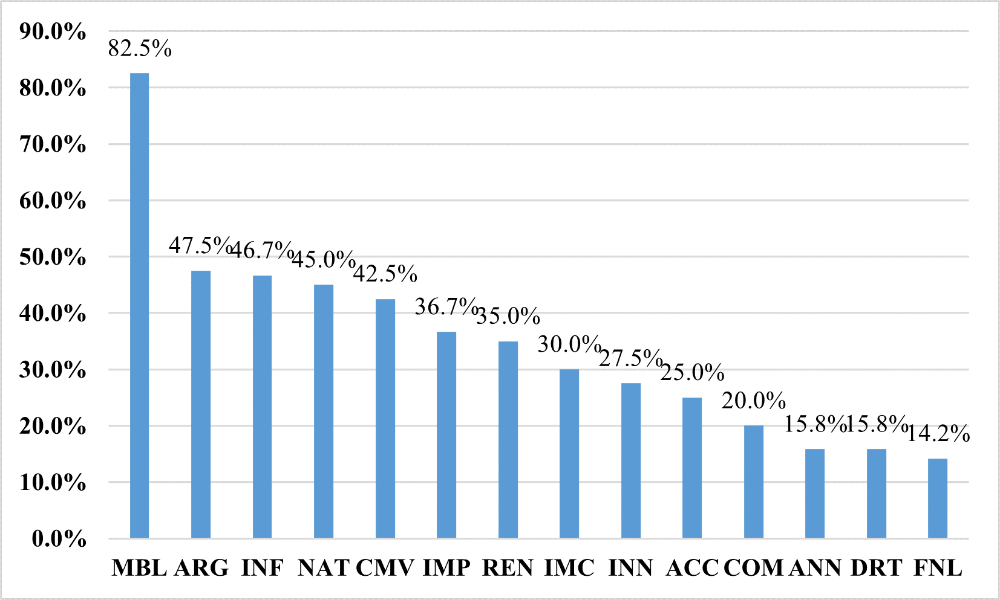
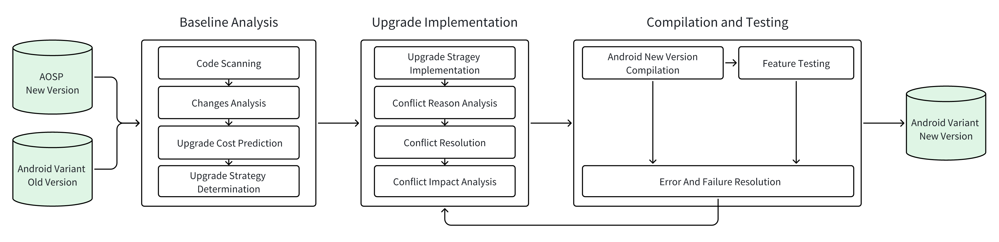
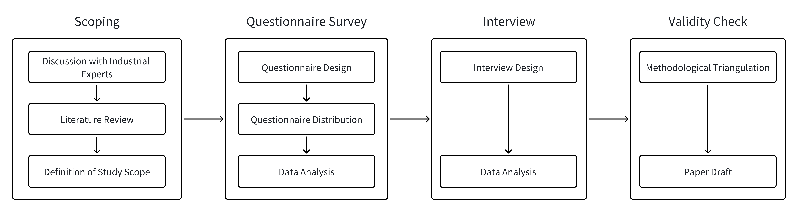

# Supplement G Review Rebuttal

## Tables

### Table 1: The distribution of 40 participants who are willing to be interviewed
<table>
  	<tr>
		<td align="center" ></td>
        <td align="center" colspan="5" ><b>Android upgrade (*frequency*)</b></td>
	</tr>
	<tr>
		<td align="center" ><b>Experience(*years*)</b></td>
        <td align="center" >>50</td>
        <td align="center" >10-50</td>
        <td align="center" >5-10</td>
        <td align="center" > <5 </td>
        <td align="center" >Total</td>
	</tr>
    <tr>
		<td align="center" >>10</td>
        <td align="center" >0</td>
        <td align="center" >3</td>
        <td align="center" >0</td>
        <td align="center" >1</td>
        <td align="center" >4</td>
    </tr>
    <tr>
		<td align="center" >5-10</td>
        <td align="center" >3</td>
        <td align="center" >6</td>
        <td align="center" >2</td>
        <td align="center" >3</td>
        <td align="center" >14</td>
    </tr>
    <tr>
		<td align="center" >3-5</td>
        <td align="center" >1</td>
        <td align="center" >7</td>
        <td align="center" >2</td>
        <td align="center" >2</td>
        <td align="center" >12</td>
    </tr>
    <tr>
		<td align="center" ><3</td>
        <td align="center" >0</td>
        <td align="center" >2</td>
        <td align="center" >1</td>
        <td align="center" >7</td>
        <td align="center" >10</td>
    </tr>
    <tr>
		<td align="center" >Total</td>
        <td align="center" >4</td>
        <td align="center" >18</td>
        <td align="center" >5</td>
        <td align="center" >13</td>
        <td align="center" >13</td>
    </tr>
</table>

### Table 2: Relationship between recommendations and Android Upgrade workflow phases

| Index | Content                                                      | Phase |
| ----- | ------------------------------------------------------------ | ----- |
| R1.1  | It is significant to maintain comprehensive documentation of the architecture including features, architecture design, and the evolution process for Android systems. | ①     |
| R1.2  | Architecture change detection tools can be enhanced to locate deprecated features, irreversible features, duplicated features, etc., and further bridge high-level architecture changes with implementation-level code modifications. | ①     |
| R1.3  | It is urgent to build a TQC prediction model based on historical data to ensure a manageable Android upgrade. | ①     |
| R2.1  | It is essential to detect intrusive modifications and enforce code standards on modifications. | ②     |
| R2.2  | Developers should pay attention to hotspot conflict codes and key conflict types. | ②     |
| R2.3  | Developers can employ tools to figure out the coupling between Android variants and AOSP. | ②     |
| R2.4  | Android variants should improve their modular design.        | None  |
| R3.1  | It is advisable to establish conflict resolution guidelines and enhance team collaboration. | ②     |
| R3.2  | The development team should learn from past experiences and patterns to create a structured knowledge base for facilitating conflict resolution. | ②     |
| R3.3  | Existing merging tools can be improved for better accuracy, performance, and usability. | ②     |
| R4.1  | It is useful to evaluate conflict impact by employing dependency analysis to consider related conflict blocks together. | ②     |
| R4.2  | Developers can summarize recurrent patterns to anticipate the conflict impact on semantic failures. | ②     |
| R4.3  | It could be considered to better decouple architectural modules, enabling building and testing modules independently on the fly for an earlier exposure of semantic errors. | ③     |
| R4.4  | The development team should improve the management platform and coding style to better track the potential impact of conflicts. | None  |

### Table 3 The demographics of questionnaire participants

<table>
  	<tr>
		<td align="center" ></td>
        <td align="center" ></td>
        <td align="center" colspan="5" ><b>Android upgrade (*frequency*)</b></td>
	</tr>
	<tr>
        <td align="center" >Role</td>
		<td align="center" ><b>Experience(*years*)</b></td>
        <td align="center" >>50</td>
        <td align="center" >10-50</td>
        <td align="center" >5-10</td>
        <td align="center" ><5</td>
        <td align="center" >Total</td>
	</tr>
    <tr>
        <td align="center" >Project Manager</td>
		<td align="center" >>10</td>
        <td align="center" ></td>
        <td align="center" >1</td>
        <td align="center" ></td>
        <td align="center" ></td>
        <td align="center" >1</td>
    </tr>
    <tr>
        <td align="center" >Android Architects</td>
		<td align="center" >>10</td>
        <td align="center" ></td>
        <td align="center" >4</td>
        <td align="center" ></td>
        <td align="center" ></td>
        <td align="center" >4</td>
    </tr>
    <tr>
        <td align="center" >Senior Developers</td>
		<td align="center" >>10</td>
        <td align="center" ></td>
        <td align="center" >2</td>
        <td align="center" >2</td>
        <td align="center" >6</td>
        <td align="center" >10</td>
    </tr>
    <tr>
        <td align="center" >Senior Developers</td>
		<td align="center" >5-10</td>
        <td align="center" >6</td>
        <td align="center" >9</td>
        <td align="center" >6</td>
        <td align="center" >8</td>
        <td align="center" >29</td>
    </tr>
    <tr>
        <td align="center" >Junior Developers</td>
		<td align="center" >3-5</td>
        <td align="center" >2</td>
        <td align="center" >10</td>
        <td align="center" >10</td>
        <td align="center" >9</td>
        <td align="center" >21</td>
    </tr>
    <tr>
        <td align="center" >Junior Developers</td>
		<td align="center" ><3</td>
        <td align="center" >1</td>
        <td align="center" >8</td>
        <td align="center" >9</td>
        <td align="center" >27</td>
        <td align="center" >45</td>
    </tr>
    <tr>
		<td align="center" >Total</td>
        <td align="center" >-</td>
        <td align="center" >9</td>
        <td align="center" >34</td>
        <td align="center" >27</td>
        <td align="center" >50</td>
        <td align="center" >120</td>
    </tr>
</table>

### Table 4 The demographics of interview participants

<table>
  	<tr>
		<td align="center" ></td>
        <td align="center" ></td>
        <td align="center" colspan="3" ><b>Android upgrade (*frequency*)</b></td>
	</tr>
	<tr>
        <td align="center" >Role</td>
		<td align="center" ><b>Experience(*years*)</b></td>
        <td align="center" >>50</td>
        <td align="center" >10-50</td>
        <td align="center" >Total</td>
	</tr>
    <tr>
        <td align="center" >Project Manager</td>
		<td align="center" >>10</td>
        <td align="center" ></td>
        <td align="center" >1</td>
        <td align="center" >1</td>
    </tr>
    <tr>
        <td align="center" >Android Architects</td>
		<td align="center" >>10</td>
        <td align="center" ></td>
        <td align="center" >2</td>
        <td align="center" >2</td>
    </tr>
    <tr>
        <td align="center" >Android Architects</td>
		<td align="center" >5-10</td>
        <td align="center" >3</td>
        <td align="center" ></td>
        <td align="center" >3</td>
    </tr>
    <tr>
        <td align="center" >Senior Developers</td>
		<td align="center" >3-5</td>
        <td align="center" >2</td>
        <td align="center" ></td>
        <td align="center" >2</td>
    </tr>
    <tr>
        <td align="center" >Senior Developers</td>
		<td align="center" ><3</td>
        <td align="center" >1</td>
        <td align="center" ></td>
        <td align="center" >1</td>
    </tr>
    <tr>
		<td align="center" >Total</td>
        <td align="center" >-</td>
        <td align="center" >6</td>
        <td align="center" >3</td>
        <td align="center" >9</td>
    </tr>
</table>

### Table 5 Distribution of venues and related aspects of papers

<table>
  	<tr>
		<td align="center" >Venue</td>
        <td align="center" >Title</td>
        <td align="center" >Study Aspects</td>
	</tr>
	<tr>
        <td align="center" rowspan=5>Conflict Prediction</td>
        <td align="left" >On the Prediction of Software Merge Conflicts A Systematic Review and Meta-analysis</td>
        <td align="center" rowspan=5>Android Baseline Analysis</td>
	</tr>
    <tr>
        <td align="left" >Analyzing Conflict Predictors in Open Source Java Projects</td>
    </tr>
    <tr>
        <td align="left" >Predicting merge conflicts in collaborative software development</td>
    </tr>
    <tr>
        <td align="left" >Automatic prediction of developers' resolutions for software merge conflicts</td>
    </tr>
    <tr>
        <td align="left" >Planning for Untangling- Predicting the Difficulty of Merge Conflicts</td>
    </tr>
	<tr>
        <td align="center" rowspan=16>Conflict Analysis</td>
        <td align="left" >Software Merge A Two-Decade Systematic Mapping Study</td>
        <td align="center" rowspan=16>Conflict Reason Analysis</td>
	</tr>
    <tr>
        <td align="left" >Mining Workspace Updates in CVS</td>
    </tr>
    <tr>
        <td align="left" >Software Practitioner Perspectives on Merge Conflicts and Resolutions</td>
    </tr>
    <tr>
        <td align="left" >The life-cycle of merge conflicts- processes, barriers, and strategies</td>
    </tr>
    <tr>
        <td align="left" >Understanding semi-structured merge conflict characteristics in open-source Java projects</td>
    </tr>
    <tr>
        <td align="left" >On the Nature of Merge Conflicts A Study of 2731 Open Source Java Projects Hosted by GitHub</td>
    </tr>
    <tr>
        <td align="left" >A Characterization Study of Merge Conflicts in Java Projects</td>
    </tr>
    <tr>
        <td align="left" >Understanding Merge Conflicts and Resolutions in Git Rebases</td>
    </tr>
    <tr>
        <td align="left" >Understanding predictive factors for merge conflicts</td>
    </tr>
    <tr>
        <td align="left" >Causes of Merge Conflicts: A Case Study of Elasticsearch</td>
    </tr>
    <tr>
        <td align="left" >An Empirical Investigation into Merge Conflicts and Their Effect on Software Quality </td>
    </tr>
    <tr>
        <td align="left" >Are Refactorings to Blame? An Empirical Study of Refactorings in Merge Conflicts</td>
    </tr>
    <tr>
        <td align="left" >Do code refactorings influence the merge effort</td>
    </tr>
    <tr>
        <td align="left" >Leveraging Structure in Software Merge An Empirical Study</td>
    </tr>
    <tr>
        <td align="left" >Automatic Detection and Resolution of Software Merge Conflicts: Are We There Yet</td>
    </tr>
    <tr>
        <td align="left" >Can Pre-trained Language Models be Used to Resolve Textual and Semantic Merge Conflicts</td>
    </tr>
    <tr>
        <td align="center" rowspan=10>Conflict Detection</td>
        <td align="left" >SCA-a semantic conflict analyzer for parallel changes</td>
        <td align="center" rowspan=10>Conflict Impact Analysis</td>
	</tr>
    <tr>
        <td align="left" >Proactive Detection of Collaboration Conflicts</td>
    </tr>
    <tr>
        <td align="left" >Early Detection of Development Conflicts Arising from Parallel Code Changes</td>
    </tr>
    <tr>
        <td align="left" >Detecting Higher-Order Merge Conflicts in Large Software Projects</td>
    </tr>
    <tr>
        <td align="left" >Detecting Build Conflicts in Software Merge for Java Programs via Static Analysis</td>
    </tr>
    <tr>
        <td align="left" >Detecting semantic merge conflicts with variability-aware execution</td>
    </tr>
    <tr>
        <td align="left" >Detecting Semantic Conflicts via Automated Behavior Change Detection</td>
    </tr>
    <tr>
        <td align="left" >Symbolic Execution to Detect Semantic Merge Conflicts</td>
    </tr>
    <tr>
        <td align="left" >Detecting Semantic Conflicts with Unit Tests</td>
    </tr>
    <tr>
        <td align="left" >Detecting Semantic Conflicts using Static Analysis</td>
    </tr>
    <tr>
        <td align="center" rowspan=11>Conflict Resolution</td>
        <td align="left" >Verified Three-way Program Merge</td>
        <td align="center" rowspan=11>Conflict Resolution</td>
	</tr>
    <tr>
        <td align="left" >IntelliMerge- a refactoring-aware software merging technique</td>
    </tr>
    <tr>
        <td align="left" >Operation-Based Refactoring-Aware Merging- An Empirical Evaluation</td>
    </tr>
    <tr>
        <td align="left" >Towards Understanding and Fixing Upstream Merge Induced Conflicts in Divergent Forks: An Industrial Case Study</td>
    </tr>
    <tr>
        <td align="left" >Conflict resolution for structured merge via version space algebra</td>
    </tr>
    <tr>
        <td align="left" >SoManyConflicts: Resolve Many Merge Conflicts Interactively and Systematically</td>
    </tr>
    <tr>
        <td align="left" >Can program synthesis be used to learn merge conflict resolutions an empirical analysis</td>
    </tr>
    <tr>
        <td align="left" >Towards accurate recommendations of merge conflicts resolution strategies</td>
    </tr>
    <tr>
        <td align="left" >DeepMerge Learning to Merge Programs</td>
    </tr>
    <tr>
        <td align="left" >Program merge conflict resolution via neural transformers</td>
    </tr>
    <tr>
        <td align="left" >Using pre-trained language models to resolve textual and semantic merge conflicts (experience paper)</td>
    </tr>
    <tr>
        <td align="center" rowspan=3>Android Upgrade Conflictsy</td>
        <td align="left" >The Android Update Problem - An Empirical Study</td>
        <td align="center" rowspan=3>Android Baseline Analysis, Conflict Reason Analysis, Conflict Resolution, Conflict Impact Analysis</td>
	</tr>
    <tr>
        <td align="left" >An Empirical Investigation of Software Merging Challenge</td>
    </tr>
    <tr>
        <td align="left" >Do Customized Android Frameworks Keep Pace with Android?</td>
    </tr>
</table>    

### Table 6 The distribution of question types

<table>
  	<tr>
		<td align="center" >Question Type</td>
        <td align="center" >Question Index</td>
        <td align="center" >Detail</td>
	</tr>
	<tr>
        <td align="center" rowspan="4">Personal Information</td>
		<td align="center" >Q1</td>
        <td align="left" >Personal Information</td>
	</tr>
    <tr>
		<td align="center" >Q2</td>
        <td align="left" >Number of Participations in Android Upgrade Processes</td>
    </tr>
    <tr>
        <td align="center" >Q3</td>
        <td align="left" >Work Experience</td>
    </tr>
    <tr>
        <td align="center" >Q4</td>
        <td align="left" >Total Number of Conflicts Resolved</td>
    </tr>
    <tr>
        <td align="center" rowspan="2">Conflict Causes and Types</td>
        <td align="center" >Q5, Q16</td>
        <td align="left" >Conflict Types</td>
    </tr>
    <tr>
        <td align="center" >Q10, Q14</td>
        <td align="left" >Conflict Causes</td>
    </tr>
    <tr>
        <td align="center" rowspan="4">Conflict Resolution</td>
        <td align="center" >Q6, Q11, Q12, Q13</td>
        <td align="left" >Conflict Resolution Process and Time</td>
    </tr>
    <tr>
        <td align="center" >Q7, Q9</td>
        <td align="left" >Conflict Resolution Methods</td>
    </tr>
    <tr>
        <td align="center" >Q15, Q21, Q22, Q27, Q28</td>
        <td align="left" >Technical and Tool Challenges</td>
    </tr>
    <tr>
        <td align="center" >Q17, Q18, Q19</td>
        <td align="left" >Familiarity with Historical Solutions</td>
    </tr>
    <tr>
        <td align="center" >Conflict Impact Analysis</td>
        <td align="center" >Q8</td>
        <td align="left" ></td>
    </tr>
    <tr>
        <td align="center" rowspan="3">Other</td>
        <td align="center" >Q23, Q24</td>
        <td align="left" >Team Management</td>
    </tr>
    <tr>
        <td align="center" >Q25, Q26</td>
        <td align="left" >Stress and Support</td>
    </tr>
    <tr>
        <td align="center" >Q29, Q30, Q31</td>
        <td align="left" >Experience Sharing and Suggestions</td>
    </tr>
    <tr>
        <td align="center" >Follow-up</td>
        <td align="center" >Q20</td>
        <td align="left" ></td>
    </tr>
</table>

## Figures

### Figure 1: Frequency distribution of 14 types of intrusive modifications made by practitioners.

### Figure 2: Android Upgrade workflow.

### Figure 3: Overview of research methodology.

